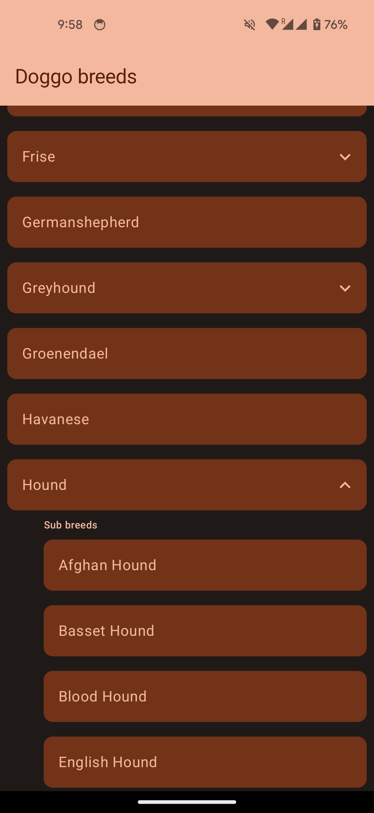
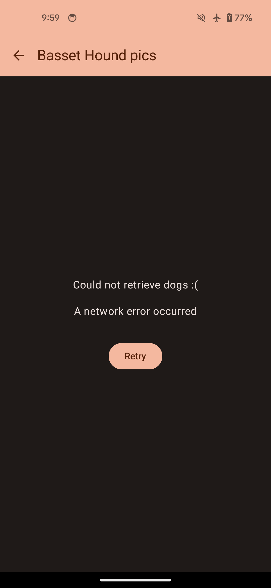
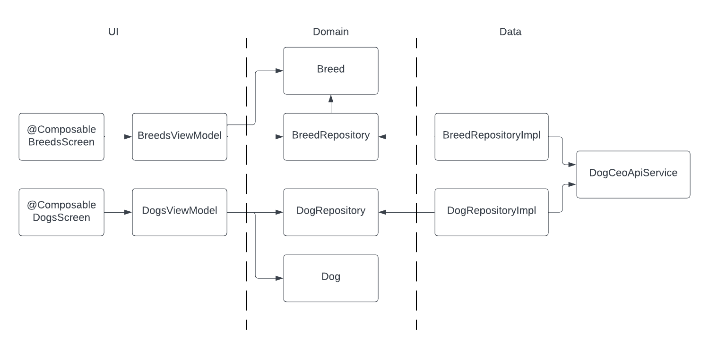

This is a simple app displaying a list of dog breeds, and when one is clicked, displays a list of random dogs pics.

It retrieves the data from the [Dog CEO API](https://dog.ceo/dog-api/).

## The app

It has 2 screen:
- Breed list screen: displays list of breeds. Breeds can be expanded to display the sub breeds. Both the breeds and sub breeds are clickable. 
- Dog pics: displays 10 random pics of dogs for the given breed or sub breed

Both the breeds and dogs screens have a loading and error states for when we are loading the data, and when we have an error retrieving it.

|  Breeds list                         | Dog pics                     | Error                    |
|--------------------------------|--------------------------------------|----------------------------------------|
|  |  |  |

## Architecture

The app has 3 layers:
- UI: with composables and view models
- Domain: with models and repository interfaces
- Data: with the network layer that interacts with the Dog CEO API.

There is another package `di` that contains Hilt module for dependency injection.

Here is a high level architecture diagram:

## Libraries

- UI: [Jetpack Compose](https://developer.android.com/jetpack/compose)
- Images: [Coil](https://coil-kt.github.io/coil/)
- DI: [Hilt](https://developer.android.com/training/dependency-injection/hilt-android)
- Network API calls: [Retrofit](https://square.github.io/retrofit/)
- Mocking: [Mockito](https://github.com/mockito/mockito)
- Assertions: [AssertJ](https://assertj.github.io/doc/)

## Testing

- There are unit tests for most of the logic under the `test` folder.
- The `DogCeoApiService` is tested in `DogCeoApiServiceTest` using Okhttp MockWebserver and Robolectric under the `test` folder.
- The composable screens are tested in `DogsScreenInternalTest` and `BreedsScreenInternalTest` that uses `ComposeTestRule` to check that components are displayed correctly. It is in the `androidTest` folder.
- There is also an integration test in `DoggoAppIntegrationTest` in `androidTest` folder that tests the entire search feature. Only the API calls are mocked using Hilt testing library.